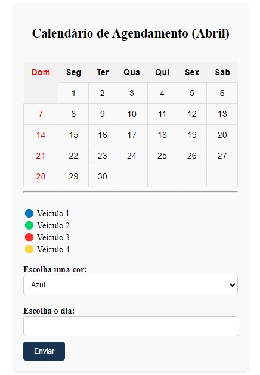

# Timetable 🗓️
 
* [Descrição](#descrição)
* [Introdução](#introdução)
* [Funcionalidades](#funcionalidades)
* [Tecnologias Utilizadas](#tecnologias-utilizadas)
* [Referências](#referências)
* [Autores](#autores)
 
# ⚜️Calendário de Agendamento de Fretes⚜️

  
 
# Descrição 📒
Com uma interface visualmente deslumbrante e altamente intuitiva, nossa aplicação permite que os usuários registrem os agendamentos de fretes de forma rápida, fácil e organizada. Imagine um calendário dinâmico, onde cada dia é marcado com cores vibrantes, representando os diferentes veículos disponíveis para realizar os fretes. Vermelho para caminhões, azul para furgões e verde para vans - uma explosão de cores que torna o agendamento não apenas eficiente, mas também emocionante!

Mas não para por aí! Ao passar o mouse sobre cada dia marcado, você será surpreendido com informações detalhadas sobre os agendamentos planejados, incluindo detalhes do frete e status de disponibilidade dos veículos. É como ter um assistente virtual sempre pronto para ajudar.

O Calendário de Agendamento de Fretes não é apenas uma ferramenta, é uma revolução no modo como a Alpha gerencia sua logística.

# Introdução 📖
A empresa Alpha é uma empresa de fretamento que necessita de uma solução eficiente para o agendamento de fretes dos veículos. A vaga de estagiário na área de agendamento demanda a criação de uma ferramenta que permita o registro dos agendamentos de forma fácil e intuitiva. Este projeto visa atender a essa demanda, fornecendo uma solução prática e funcional para o agendamento de fretes.

Imagine um sistema de marcação de dias no calendário para agendar fretes, onde cada dia é marcado com a cor do veículo que realizará o frete. Esta funcionalidade proporciona uma visualização clara e rápida dos dias disponíveis e dos veículos atribuídos para cada data. Cada cor representa um veículo específico, facilitando a identificação e organização dos agendamentos.

Por exemplo:
* Dias marcados em vermelho indicam que o frete será realizado por um caminhão.
* Dias marcados em azul indicam que o frete será realizado por um furgão.
* Dias marcados em verde indicam que o frete será realizado por uma van.
* Essa abordagem visual torna o planejamento logístico mais eficiente, permitindo que os usuários vejam de relance quais veículos estão disponíveis em determinadas datas e evitando conflitos de agendamento.
Além disso, ao passar o mouse sobre cada dia marcado, informações adicionais, como o número de fretes agendados ou detalhes específicos do frete, podem ser exibidas, proporcionando uma experiência mais informativa e interativa para os usuários.
 
## Funcionalidades ⚙️
- Marcação de dias no calendário, atribuindo a eles a cor do veículo que realizará o frete.
## 📌Identificação visual dos veículos através das cores:
- Azul para o veículo 1
- Verde para o veículo 2
- Rosa para o veículo 3
- Amarelo para o veículo 4

## 🚨Restrições de agendamento:
- Um veículo não pode realizar mais de um frete no mesmo dia.
- Cada veículo pode realizar no máximo 3 fretes por mês.
 
## Tecnologias Utilizadas 💻
- HTML5
- CSS3
- JavaScript
